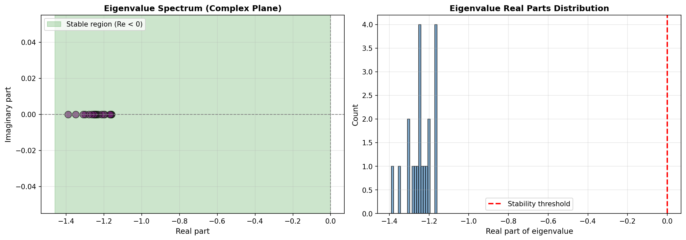
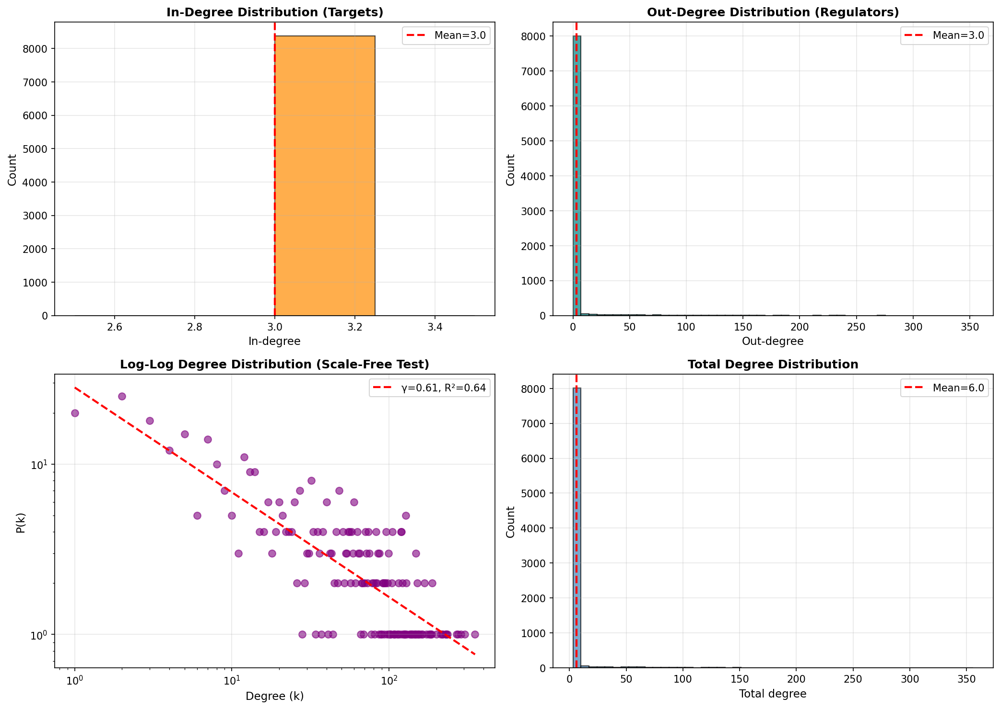

## Epigenetically‑Informed GRN for Control (Breast Cancer)

Builds a control‑ready, signed, stable gene regulatory network (GRN) from TCGA breast cancer by combining expression with DNA methylation, then validates network science properties and provides an MPC/LQR‑ready interface.

---

### TL;DR
- **System**: 8,378 genes, 25,134 signed edges, 99.96% sparse
- **Stability**: λ_max ≈ -1.16 (all eigenvalues < 0, stable)
- **Epigenetics**: 100% methylation coverage (4,842 suppressed, 3,536 enhanced)
- **Topology**: Small‑world (clustering 0.133, path 3.77), not scale‑free (γ≈0.615), max out‑degree 353
- **Control‑ready**: 7,899 driver nodes (94%). Ready for LQR/MPC with custom B

---

### How it works (idea → execution)
1. Preprocess TCGA tumor data (variance filtering, imputation) → 8,378 genes
2. Infer GRN with ElasticNet (signed coefficients), keep top‑3 regulators/target
3. Integrate methylation via per‑gene diagonal scaling of incoming edges
4. Stabilize with Gershgorin diagonal dominance (set A[i,i] below −radius−margin)
5. Validate network science metrics and spectrum; export plots and metadata
6. Provide `A_final_stable.npz` + helpers for control design (`mpc.py`)

---

### Major results
| Metric | Value | Notes |
| --- | --- | --- |
| Nodes / Edges | 8,378 / 25,134 | Signed, sparse (0.036% dense) |
| Stability | λ_max ≈ -1.16 | Stable after Gershgorin (margin 0.05) |
| Methylation | 100% coverage | 4,842 suppressed, 3,536 enhanced |
| Small‑world | C=0.133, L=3.77 | vs random: much higher C, shorter L |
| Scale‑free | No (γ≈0.615) | Top‑k=3 imposes uniform in‑degree |
| Hubs | max out‑deg = 353 | Master regulators present |
| Controllability | 7,899 drivers (94%) | Many actuation candidates |

---

### Figures




---

### Use this repository (quick start)
```python
from scipy.sparse import load_npz
import pandas as pd

A = load_npz("o2/A_final_stable.npz")
genes = pd.read_csv("o2/genes_final.csv")["gene"].tolist()
print(A.shape, A.nnz)
```

Control demo (discrete‑time, unconstrained MPC/LQR):
```python
import numpy as np
from mpc import MPCController, make_B_from_A

n = A.shape[0]; m = 20
B = make_B_from_A(A.toarray(), strategy="top_degree", m=m, scale=0.1, base_dir=".")
Q = np.eye(n); R = 0.1*np.eye(m); Qf = 10*np.eye(n)
mpc = MPCController(A.toarray(), B, Q, R, N=20, Qf=Qf)
x0 = np.zeros(n); x_target = np.zeros(n)
Xs, Us = mpc.simulate(x0, steps=50, x_target=x_target)
```

---

### Limitations and assumptions
- Linear, time‑invariant dynamics; ignores nonlinearities, delays, saturation
- Top‑k=3 incoming edges enforces uniform in‑degree (not scale‑free)
- Methylation integration via correlation‑based scaling (associational, not causal)
- One cancer type (TCGA BRCA); no cross‑dataset or wet‑lab validation
- Control examples are unconstrained (no input/state bounds); B design is heuristic

---

### Files you need
- `o2/A_final_stable.npz`: final system matrix (CSR sparse)
- `o2/genes_final.csv`: gene names
- `o2/graph_stats.json`, `o2/stabilization_info.json`, `o2/integration_params.json`: metrics
- Plots: `o2/eigenvalue_spectrum.png`, `o2/degree_distributions.png`, `o2/random_network_comparison.png`
- Control helpers: `mpc.py` (finite‑horizon LQR/MPC, B‑matrix builders)

---

### Citation
```bibtex
@misc{grn_control_2025,
  title={Epigenetically-Informed Gene Regulatory Network for Control Theory},
  author={[Your Name]},
  year={2025},
  note={IIIT Hyderabad - DPCN Course Project}
}
```
